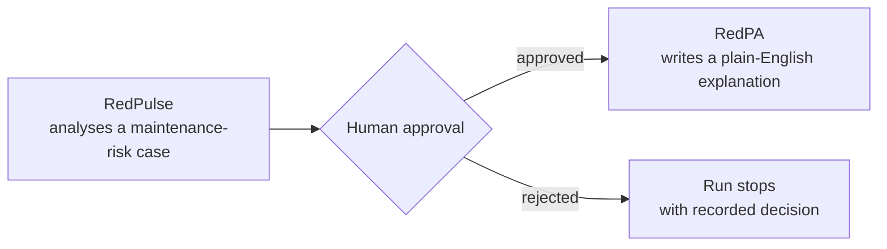
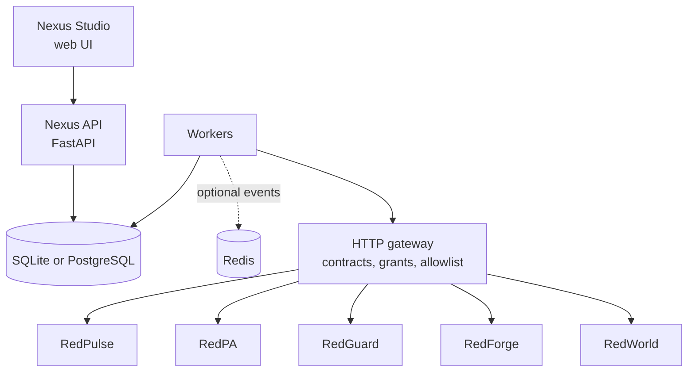

# RedNexus AI

**Governed orchestration for independent AI projects. Shared workflows, memory and human review.**

> **Source-available for non-commercial use. Not open source.** See [LICENSE](LICENSE).
>
> **Status:** `2.0.0rc2`, a release candidate. It is not a certified stable deployment.

[راهنمای نصب فارسی](docs/INSTALL_RC2_FA.md) · [Architecture](docs/PLATFORM_v1.md) · [Integration status](docs/INTEGRATION_STATUS.md) · [Test evidence](docs/TEST_EVIDENCE.md)

---

## What is RedNexus?

RedNexus connects a family of separate AI projects through versioned HTTP contracts. Each project keeps its own repository, runtime and database. RedNexus does not merge them. It coordinates them.

| Project | Capabilities used by RedNexus | Role |
|---|---|---|
| **RedPulse** | `redpulse.analyze` | Maintenance-risk analysis |
| **RedPA** | `redpa.documents`, `redpa.chat` | Personal assistant: documents and plain-language explanations |
| **RedGuard** | `redguard.inspect` | Inspection scoring and artifact records |
| **RedForge** | `redforge.scan` | Repository scanning |
| **RedWorld** | `redworld.snapshot`, `redworld.advance` | Simulated world state |

The goal is not only to connect APIs. Every cross-project action runs as a workflow with permissions, human approval, execution history and evidence.

### Example flow



The workflow pauses before the write step. Nothing reaches RedPA until a reviewer with the right grant approves it.

## Design principles

- **Human approval for writes.** All exposed native writes require review. Model proposals cannot bypass grants or approval.
- **No silent replays.** If a write's outcome is uncertain, it is never retried automatically. It goes to a failed-run inbox.
- **Explicit permissions.** Even administrators need separate `tool:<name>` and `review:<name>` grants.
- **Honest evidence.** Mocked responses never count as live verification. Skipped tests never count as passing gates.
- **Independent projects.** Registering a capability never loads foreign Python code into the Nexus process.

## Features

| Area | What it does |
|---|---|
| Workflows | Bind outputs of earlier steps with JSON Pointers, run conditional steps, validate final inputs before approval |
| Templates | Immutable, workspace-scoped versions; permissions rechecked on every run |
| Capability onboarding | Persistent registration, origin allowlist, version and fingerprint checks, live health probes |
| Memory | Scoped provenance, versioning and retention; optional embeddings with cosine search |
| Agent teams | Scoped assignments, parallel independent workflows, shared reserved budget, team plan proposals |
| Operations | Worker locks and status, concurrency, `doctor` diagnostics, failed-run inbox |
| Credentials | Environment or external store; Windows DPAPI, owner-only files on Unix |
| SDK | HTTP adapter factory with durable idempotency receipts; Python client |
| Studio | Web UI for workflows, templates, service status, agent teams, memory and operations |
| Compatibility | `/v1` API kept alongside `/v2` routes, with additive database migrations |

## Architecture



- **API and Studio:** FastAPI on port `8000`, with the OpenAPI specification at `/docs`.
- **Storage:** SQLite for local use, PostgreSQL for distributed workers. SQL leases arbitrate jobs.
- **Workers:** parallelism is across independent workflows, not within the steps of a single run.
- **Redis:** optional event transport only.

## Quick start (demo mode)

Requires **Python 3.12+**. The default manifest, `config/projects.json`, uses simulated services, so no Red projects need to be running.

**Windows (PowerShell)**

```powershell
python -m venv .venv
.\.venv\Scripts\python.exe -m pip install -r requirements-dev.txt
.\.venv\Scripts\python.exe -m rednexus.platform.cli migrate
.\.venv\Scripts\python.exe -m rednexus.platform.cli bootstrap --workspace red --username admin
.\.venv\Scripts\python.exe -m rednexus.platform.cli launch
```

**Linux / macOS**

```bash
python3 -m venv .venv
.venv/bin/python -m pip install -r requirements-dev.txt
.venv/bin/python -m rednexus.platform.cli migrate
.venv/bin/python -m rednexus.platform.cli bootstrap --workspace red --username admin
.venv/bin/python -m rednexus.platform.cli launch
```

`bootstrap` asks you to choose an admin password of at least 12 characters. There is no default password. Then open <http://127.0.0.1:8000>.

The launcher starts the Nexus API and one worker with concurrency 2. Keep the terminal open.

For Docker Compose with PostgreSQL and Redis, see [docs/OPERATIONS.md](docs/OPERATIONS.md).

## Connecting live Red services

`launch --ecosystem` switches from the simulated manifest to the native HTTP manifest. On Windows, `ECOSYSTEM.ps1` wraps the common tasks:

```powershell
.\ECOSYSTEM.ps1 -Action doctor        # database check and live health of every capability
.\ECOSYSTEM.ps1 -Action preflight     # readiness checks before running live workflows
.\ECOSYSTEM.ps1 -Action redpa-login -Username you@example.com
.\START_ECOSYSTEM.cmd
```

The launcher does not start the Red projects themselves. Each one runs from its own repository. `redpa.chat` may invoke a paid model and always pauses for review.

See [docs/ECOSYSTEM_SETUP_FA.md](docs/ECOSYSTEM_SETUP_FA.md) and [docs/ADAPTER_GUIDE.md](docs/ADAPTER_GUIDE.md) for configuration details.

## API overview

| Endpoint | Purpose |
|---|---|
| `POST /v2/validate` | Validate a workflow before running it |
| `POST /v2/templates`, `POST /v2/templates/{id}/runs` | Create and run versioned templates |
| `POST /v2/capabilities`, `GET /v2/discovery` | Register and discover capabilities |
| `POST /v2/agent-teams/plan`, `POST /v2/mission-groups` | Plan and run agent-team work |
| `POST /v2/runs/{id}/replan`, `POST /v2/runs/{id}/retry-read` | Recover runs safely |
| `POST /v2/memory/index/{namespace}`, `POST /v2/memory/search` | Index and search semantic memory |
| `GET /v2/operations`, `GET /v2/dead-letters` | Operational status and failed runs |

A step binding looks like this. Only earlier steps can be referenced, and step indexes start at zero:

```json
{"content": {"step": 0, "pointer": "/result", "format": "json"}}
```

A runnable example is in [examples/v2-bindings.json](examples/v2-bindings.json).

## Testing and validation

```bash
python -m pytest -q
python scripts/validate.py
python scripts/check_release.py
```

CI runs unit tests on Windows and Ubuntu with Python 3.12 and 3.14, PostgreSQL and Redis service tests, and browser tests for Studio.

`check_release.py` intentionally exits with code `2` until every target validation is recorded. That is the release gate working as designed, not a failure.

## Current limits

This is a release candidate, and the documentation states what has not been established:

- Some integrations are verified against source-level contracts, not against a full deployment of each project. See [docs/INTEGRATION_STATUS.md](docs/INTEGRATION_STATUS.md).
- Semantic memory is capped at 500 current records per namespace, 4,096 dimensions and 50 results per search. It is not a large vector database.
- Estimated tool reservations are not provider invoices.
- Authentication is native. There is no OIDC or MFA federation.

## Documentation

| Document | Contents |
|---|---|
| [PLATFORM_v1.md](docs/PLATFORM_v1.md) | Architecture, trust boundaries and runtime semantics |
| [V2_IMPLEMENTATION.md](docs/V2_IMPLEMENTATION.md) | v2 scope |
| [ADAPTER_GUIDE.md](docs/ADAPTER_GUIDE.md) | Writing an adapter for a new project |
| [OPERATIONS.md](docs/OPERATIONS.md) | Backups, recovery, Docker, telemetry |
| [INTEGRATION_STATUS.md](docs/INTEGRATION_STATUS.md) | What is verified per project, and what is not |
| [TEST_EVIDENCE.md](docs/TEST_EVIDENCE.md) | Executed validation and skipped checks |
| [ROADMAP_1_TO_8.md](docs/ROADMAP_1_TO_8.md) | Roadmap |
| [CHANGELOG.md](CHANGELOG.md) | Release history |

## License

RedNexus AI is released under the **RedNexus AI Source-Available License 1.0**.

You may view, study, download, run and privately modify it for personal, educational, research and other non-commercial purposes. Commercial use, hosted or paid services, and public redistribution of modified versions require a separate written license.

RedPA, RedGuard, RedPulse, RedForge and RedWorld are separate works under their own licenses. See [LICENSE](LICENSE) for the full terms.

## Author

Built by **Saeid Khalilian**. For commercial licensing or other permissions, please open an issue in this repository.
