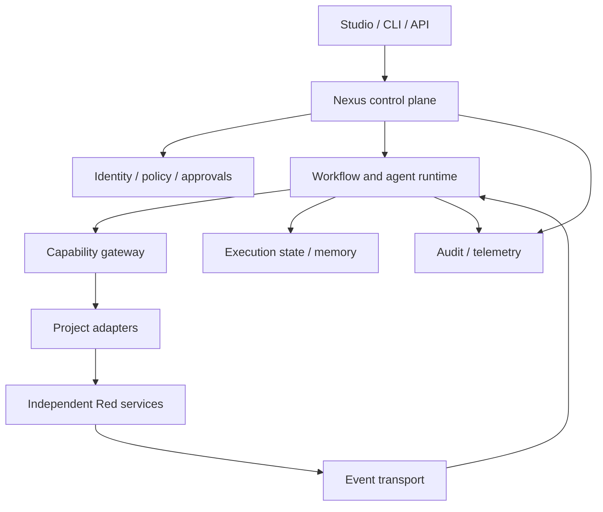

# RedNexus AI — Ecosystem Blueprint

Design baseline: 2026-09-17. Status: proposed architecture + v0.0.1 local reference implementation.
Owner: Saeid Khalilian. Product category: federated AI ecosystem orchestration platform.

## 1. Product vision

RedNexus turns a goal into governed collaboration across independent Red* systems. It supplies shared execution infrastructure, identity, contracts and visibility while preserving each project's domain ownership, release cycle and repository.

**Product promise:** one mission, multiple specialized systems, a traceable outcome.

The initial user is the ecosystem builder/operator. Later users include developers adding capabilities, analysts composing workflows, reviewers approving consequential actions, and organizations running isolated workspaces. These are roadmap personas, not capabilities already shipped.

The primary unit of value is a **mission**: objective + constraints + approved plan + evidence + outcome. A workflow is its executable structure. An agent can propose or execute an authorized step; it is not the authority that grants itself access.

Initial mission: investigate an operational anomaly, retrieve supporting knowledge, optionally verify visual evidence, evaluate a proposed response in simulation, and prepare a software change for review. Visual verification is conditional on actual visual input; simulations are conditional on a relevant validated model. The demo exercises all five interfaces only to demonstrate orchestration, not domain validity.

Success measures: completed missions with evidence; contract compatibility; approval coverage; unauthorized actions blocked; latency and cost per mission; recovery without duplicate side effects; adapter onboarding effort. Record baselines before setting production SLOs. Initial gates are measurable correctness tests, not claims of industrial scale.

Non-goals for the foundation: merging repositories, centralizing all domain databases, letting an LLM bypass policy, replacing every project's local runtime, or calling mocks real integrations.

## 2. Make the ambition larger in useful ways

- **Nexus Studio:** mission authoring, live execution, evidence inspection, approval inbox, capability catalog.
- **Resource governor:** per-mission limits for model tokens, money, time, tool calls, recursion and concurrent agents; hard stop when exhausted.
- **Evaluation and replay:** benchmark workflows, compare planner/model versions, replay recorded observations without reissuing writes.
- **Simulation gateway:** request a suitable RedWorld scenario and compare candidate policies. Simulation output is evidence with model/version/assumption metadata; it cannot guarantee real-world safety.
- **Federated deployments:** connect local or remote installations using explicit trust agreements and scoped service identities.
- **Capability SDK/catalog:** future Red* projects join by implementing contracts, compatibility tests and health checks.

These extend the central product; they do not require inventing more independent projects now.

## 3. System architecture

Use a modular control-plane application initially, with separate domain services and optional execution workers. Split core modules into services only when independent scaling, isolation or ownership justifies it.



Control plane owns tenant/workspace configuration, capability registrations, policy, workflow definitions, approval records and execution state. Data plane executes tasks and connects to domain services. Knowledge plane provides scoped memory retrieval and provenance. Governance spans all planes.

**Failure boundaries:** domain outages do not take down registry or approval review. An unavailable capability becomes unavailable, not silently replaced by a more privileged tool. Core outages stop new coordinated work; projects can continue their independent work. Event delivery and synchronous command execution are separate paths.

**Scale path:** single process and SQLite prototype → API + PostgreSQL + workers → durable workflow engine and event broker → partitioned worker pools and tenant quotas → federation where justified. Do not deploy Kubernetes merely because the long-term diagram is large.

## 4. Project integration model

| Project | Owns | Proposed capabilities | Proposed emitted events |
|---|---|---|---|
| RedPA AI | Knowledge ingestion, retrieval and domain agent logic | knowledge.search, answer.with_evidence | knowledge.indexed.v1 |
| RedGuard AI | Vision verification and its evidence | vision.verify | verification.completed.v1 |
| RedPulse AI | Signals, predictions and operational analysis | operations.analyze, forecast.run | anomaly.detected.v1 |
| RedForge AI | Repository analysis, code/test/repair workflow | change.plan, change.prepare | change.proposed.v1 |
| RedWorld AI | World state, society/economy simulation | scenario.run, policy.compare | simulation.completed.v1 |

These names are target contracts. Actual endpoints, versions and capabilities must be obtained from each repository before a real adapter is enabled. No existing repository has been inspected or modified for this release.

Every adapter maps domain schemas into Nexus contracts, checks compatibility, translates errors and propagates identity/correlation. It must not bypass the domain service's own authorization. Projects retain local storage, licensing decisions, deployment and testing. Sharing means publishing an authorized projection or reference, never reading another project's database directly.

Admission pipeline: inspect existing API → publish capability manifest → validate input/output schemas → run contract tests → verify identity mapping and permissions → pass timeout/failure/idempotency checks → register in staging → enable in selected workflows.

Manifest target fields: project_id, service_id, release, contract_version, owner, base_url, transport, capabilities, input_schema, output_schema, scopes, side_effect_class, approval_policy, timeout, idempotency_support, health_endpoint, data_classification. Endpoint registration is administrative, with address allowlists to prevent SSRF. Runtime discovery returns only caller-visible healthy capabilities; stale health or incompatible versions fail closed.

Core changes must not be required to onboard another conforming project. Breaking contracts create a new major version; additive optional fields remain compatible. Keep an explicit supported-version matrix, deprecation window and consumer contract tests.

## 5. Nexus Core and contracts

Core domain objects: Workspace, Principal, Service, Capability, Mission, WorkflowDefinition, Run, Step, Approval, ArtifactReference, MemoryRecord, Event, PolicyDecision and Budget.

The command envelope target contains command_id, tenant_id, actor_id, run_id, step_id, capability, capability_version, input, idempotency_key, deadline, trace_context and policy_context. Actor and tenant come from verified identity, never blindly from client JSON. Output includes status, typed result, artifact references, evidence and structured errors. Large documents/images stay in object storage with access-controlled references.

Planned API surface:

| Endpoint | Purpose |
|---|---|
| POST /v1/runs | Submit validated workflow with idempotency key |
| GET /v1/runs/{id} | Authorized status and evidence |
| POST /v1/runs/{id}/cancel | Request safe cancellation |
| GET /v1/capabilities | Discover allowed available capabilities |
| GET /v1/approvals | Reviewer-scoped inbox |
| POST /v1/approvals/{id}/decision | Approve/reject a bound action |
| POST /v1/memory/search | Retrieval after scope authorization |

No HTTP endpoints ship in v0.0.1. Its Python API is an executable reference for these semantics.

## 6. Agent runtime

A deterministic supervisor owns workflow transitions. Planners can propose a structured plan; validation, policy and budgets decide what may execute. Each agent has identity, role, allowed capabilities, memory scopes, model policy and resource limits. Tool execution always passes through the capability gateway.

Target lifecycle: submitted → validated → queued → running → waiting_approval / waiting_event → completed / failed / cancelled / expired. Steps have independent state and evidence. On restart, completed steps are not executed again. A tool call whose result is unknown requires reconciliation against a domain idempotency key; blindly retrying a write is forbidden.

Parallel branches, joins, cancellation propagation and compensating actions belong in a durable workflow system. Compensation is a domain action, not an assertion that every real-world operation is reversible. Agents may use LangGraph locally later; the outer business workflow and recovery state remain owned by Nexus. Model routing and tool protocol adapters are replaceable ports.

The local release runs a bounded sequential plan (maximum 20 steps). There is no LLM, autonomous planner, sandbox, asynchronous worker, timeout enforcement, automatic retry or parallel execution. Synchronous trusted mock handlers can hang; do not attach untrusted or effectful handlers to this prototype.

## 7. Memory and data ownership

| Memory category | Owner / scope | Target backend |
|---|---|---|
| Working context | One run, short TTL | Runtime state |
| Episodic outcomes | Workspace and authorized mission | PostgreSQL + artifact store |
| Semantic knowledge | Source project with scoped retrieval | RedPA adapter; vector index where needed |
| Procedural knowledge | Versioned workflow/policy definitions | Git + configuration database |
| World state | RedWorld, per world/branch | RedWorld's own persistence |

A shared memory interface does not create a global unrestricted prompt. Each record carries tenant, namespace, source, author/service, time, classification, version and retention policy. Retrieval authorization occurs before ranking and again before returning evidence; cache keys include scope. A denied source must not leak through embeddings, summaries or logs. Derived records preserve provenance and access restrictions.

Prefer source references and minimal authorized summaries. RedPA remains responsible for its RAG knowledge instead of duplicating its entire ingestion stack in Nexus. Start without a graph database; introduce a graph projection only when demonstrated queries need it.

v0.0.1 implements tenant/namespace-scoped key-value memory, source reference and timestamp. TTL, deletion workflows, encryption, version history, semantic retrieval and fine-grained per-record ACLs are future work.

## 8. Event system

Adopt CloudEvents-style envelopes for common event metadata. The specification describes events in a common interoperable format: https://cloudevents.io/ . Local events use specversion, id, source, type, time, subject and data, with tenantid and correlationid extensions.

Target additional metadata: causationid, traceparent, dataschema and producer release. Use past-tense facts as events; commands request work and have an explicit authorized recipient. Never treat an event payload as permission to invoke a privileged capability.

Target delivery is at least once, not magical exactly once. Persist domain state plus an outbox entry in one database transaction; publish asynchronously; consumers use inbox/deduplication keys and acknowledge after committing. Order only where required (e.g. per aggregate), record poison messages in a dead-letter queue, bound retries with backoff and expose replay controls. Replay must not recreate already-completed external side effects.

v0.0.1 stores transitions and event entries in the same SQLite transaction. This is a persistent event journal, not a distributed event bus: no subscriptions, transport, acknowledgments, outbox publisher or dead-letter queue yet.

## 9. Identity, security and human approval

Target shared identity: one trusted OIDC identity provider; user identities, workload identities and tenant/workspace membership remain distinct. Validate issuer, audience, expiry and signature. Derive tenant and role from verified membership, not request headers. Use short-lived service credentials and explicit delegation with the intersection of user, agent and service permissions.

Start with roles plus exact capability grants; add attribute policies for resource, tenant, sensitivity and environment. Deny by default. Domain systems authorize again at their boundary. Model prompts, retrieved documents, events and adapter results are untrusted data, never policy. Keep secrets in a secret manager, out of memory and model context. Control network egress and run code-generation execution in disposable, restricted workers before allowing real RedForge changes.

Approval target binds reviewer, run, step, canonical input digest, artifact version, policy revision and expiry. Any plan/artifact change invalidates approval. Recheck permissions immediately before execution. Reviewers see the actual proposed action, evidence and impact; self-approval is prohibited by the initial policy. Approval is scoped consent, not an unrestricted agent token.

Risk examples: read-only retrieval may execute automatically; modifying a repository, deployment, sending a message or changing a real system needs policy-appropriate review. Simulation actions stay in their simulation environment and never implicitly authorize real actions.

The local principal objects are supplied by trusted Python code and are forgeable by anyone with code/database access. They exercise authorization semantics, not authentication. The local reviewer is simulated in the demo; this is not evidence of a real human approving an action. Database records are not tamper-evident. Network exposure is outside this release's scope.

## 10. Observability and operational model

Every mission needs correlation across plan, step, adapter call, event and approval. Add structured logs, latency/error/cost metrics and distributed traces. OpenTelemetry provides instrumentation and export of traces, metrics and logs, while separate backends store/visualize them: https://opentelemetry.io/docs/what-is-opentelemetry/ .

Audit records answer who requested what, which policy allowed it, who approved, what ran and what changed. Separate sensitive audit retention from debug logs. Telemetry must omit secrets and minimize personal data. Track queue age, stale capabilities, exhausted budgets, approval age and uncertain side effects.

Target resilience gates: database backup/restore tested; worker crash/restart tested; broker redelivery tested; dependency failures isolated; ambiguous writes reconciled; tenant isolation verified across logs, artifacts, memory and events. Load-test representative missions before promising throughput.

v0.0.1 provides correlated persisted events and inspectable run state only. It has no OTel exporter, dashboard, alerting, cost meter or production SLO.

## 11. Stack decisions and alternatives

| Area | Foundation | Proposed growth path / reason |
|---|---|---|
| Language | Python 3.12+ standard library | Python aligns with existing ecosystem; test user's 3.14 environment separately |
| Interface | Python API + demo CLI | FastAPI and validated schemas after API boundary work |
| State | SQLite, one trusted process | PostgreSQL before multiple workers |
| Orchestration | Explicit sequential state machine | Evaluate Temporal at durable waits/recovery milestone |
| Events | Transactional local journal | Evaluate NATS JetStream; select after ordering/replay tests |
| Identity | Injected trusted-local principals | OIDC provider with workload credentials |
| Knowledge | Scoped key-value records | Federated RedPA retrieval; object store for artifacts |
| Telemetry | Correlated journal | OpenTelemetry + selected metrics/log/trace backends |
| UI | None yet | Nexus Studio with mission timeline and approval inbox |
| Deployment | Local command | Compose first; Kubernetes only for a measured operational need |

Temporal documents persisted workflow execution as its core abstraction; evaluate it rather than rebuilding distributed recovery indefinitely: https://docs.temporal.io/ . These are proposed technology choices, not installed dependencies or a claim that current releases were integration-tested.

## 12. Repository structure

Current:

```text
rednexus-ai/
  README.md
  START_HERE_FA.md
  pyproject.toml
  VALIDATE.ps1
  rednexus/
    __init__.py
    core.py
    demo.py
  tests/test_core.py
  docs/
    BLUEPRINT.md
    ROADMAP.md
    INTEGRATION_CHECKLIST.md
    RELEASE_v0.0.1.md
  examples/capability-manifest.json
```

Target as implementation grows: split rednexus into contracts/, identity/, policy/, registry/, workflows/, agents/, memory/, events/, approvals/, telemetry/ and adapters/. Add apps/api, apps/worker, apps/studio and packages/sdk only when implemented. Maintain one small Nexus repository; each existing Red project remains outside it in its own repository. Shared contracts are versioned releases, not imports into another repo's internal modules.

## 13. Architecture decisions

ADR-001: federated repositories and domain data ownership. Avoid cross-database coupling.
ADR-002: modular core first; operationally independent workers when needed.
ADR-003: deterministic orchestration outside probabilistic planning.
ADR-004: approval bound to concrete action; authorization remains separate.
ADR-005: at-least-once transport with idempotency/reconciliation.
ADR-006: scoped memory and provenance instead of a global prompt store.
ADR-007: capabilities and schemas form the integration boundary.
ADR-008: cost and quality are first-class constraints, alongside latency.
ADR-009: local prototype claims must stay distinct from production controls.

Open decisions: first live deployment location, preferred identity provider, permissible shared datasets, model budget, first real adapter/API versions and ecosystem license. They do not block the reference core. No license from another project is automatically applied to Nexus.
